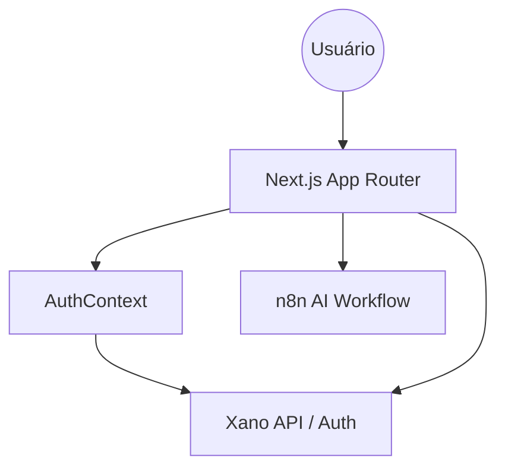

# Architecture Notes

Este documento detalha a arquitetura do sistema, as decisões de design e os padrões utilizados no desenvolvimento da plataforma de criação de livros.

## System Architecture Overview

A aplicação é construída sobre o framework **Next.js 16** utilizando o **App Router**. A arquitetura segue um modelo de **Frontend-as-a-Service**, onde a lógica de interface e orquestração reside no Next.js, enquanto a persistência de dados e autenticação são delegadas ao **Xano** (Backend-as-a-Service) e o processamento pesado de IA é delegado ao **n8n**.

As requisições fluem da seguinte forma:
1. O usuário interage com **Client Components** (React).
2. A lógica de negócio é orquestrada via **Hooks** e **Context API**.
3. Chamadas de API são feitas para o Xano (CRUD e Auth) ou n8n (Geração de IA).
4. O estado é atualizado e refletido na UI através de transições animadas com Framer Motion.

## Architectural Layers

- **Presentation Layer**: Páginas e layouts em [`src/app/`](src/app) e componentes de UI em [`src/components/ui/`](src/components/ui).
- **State Management Layer**: Gerenciamento de autenticação em [`src/context/AuthContext.tsx`](src/context/AuthContext.tsx).
- **Service/API Layer**: Abstração de chamadas externas em [`src/lib/api.ts`](src/lib/api.ts) e [`src/lib/auth-service.ts`](src/lib/auth-service.ts).
- **Security Layer**: Proteção de rotas via [`src/components/ProtectedRoute.tsx`](src/components/ProtectedRoute.tsx).

> See [`codebase-map.json`](./codebase-map.json) for complete symbol counts and dependency graphs.

## Detected Design Patterns

| Pattern | Confidence | Locations | Description |
|---------|------------|-----------|-------------|
| **Provider Pattern** | 100% | [`src/context/AuthContext.tsx`](src/context/AuthContext.tsx) | Gerencia e distribui o estado de autenticação para a árvore de componentes. |
| **Higher-Order Component (Wrapper)** | 90% | [`src/components/ProtectedRoute.tsx`](src/components/ProtectedRoute.tsx) | Protege rotas privadas verificando o estado de autenticação. |
| **Service Pattern** | 95% | [`src/lib/api.ts`](src/lib/api.ts), [`src/lib/auth-service.ts`](src/lib/auth-service.ts) | Encapsula a lógica de comunicação com APIs externas. |
| **Wizard Pattern** | 100% | [`src/app/dashboard/create/page.tsx`](src/app/dashboard/create/page.tsx) | Gerencia o fluxo multi-etapa de criação de livros. |

## Entry Points

- **Main Application**: [`src/app/page.tsx`](src/app/page.tsx)
- **Global Layout**: [`src/app/layout.tsx`](src/app/layout.tsx)
- **Auth Entry**: [`src/app/auth/login/page.tsx`](src/app/auth/login/page.tsx)
- **Dashboard Entry**: [`src/app/dashboard/page.tsx`](src/app/dashboard/page.tsx)

## Public API

| Symbol | Type | Location |
|--------|------|----------|
| `AuthProvider` | Function | [`src/context/AuthContext.tsx`](src/context/AuthContext.tsx) |
| `useAuth` | Function | [`src/context/AuthContext.tsx`](src/context/AuthContext.tsx) |
| `getBooks` | Function | [`src/lib/api.ts`](src/lib/api.ts) |
| `ProtectedRoute` | Function | [`src/components/ProtectedRoute.tsx`](src/components/ProtectedRoute.tsx) |
| `Book` | Type | [`src/lib/api.ts`](src/lib/api.ts) |

## External Service Dependencies

- **Xano**: Utilizado para armazenamento de dados (PostgreSQL), lógica de backend e autenticação JWT.
- **n8n**: Orquestrador de workflows de IA, responsável por receber o briefing e retornar a estrutura do livro.
- **Vercel**: Plataforma de hospedagem e deployment (assumido pelo uso de Next.js).

## Diagrams

## Top Directories Snapshot

- `src/app/`: ~15 arquivos (Rotas e Páginas)
- `src/components/ui/`: ~10 arquivos (Componentes base)
- `src/lib/`: ~3 arquivos (Serviços e Utils)
- `src/context/`: ~1 arquivo (Estado Global)

## Related Resources

- [Project Overview](./project-overview.md)
- [Development Workflow](./development-workflow.md)
- [`codebase-map.json`](./codebase-map.json)
